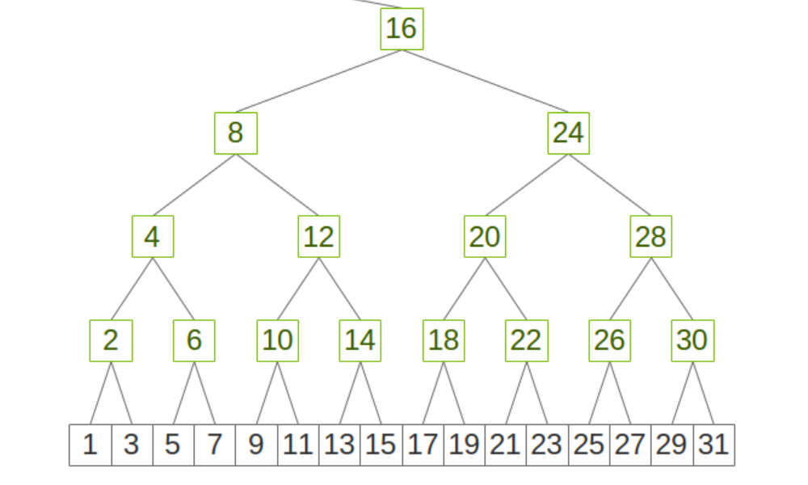

PAT is the abbreviation of Parallel Aggregated Trees. It's introduced in NCCL 2.23.4. Please see NCCL [release note](https://docs.nvidia.com/deeplearning/nccl/release-notes/rel_2-23-4.html) for details. 


PAT algorithms are a variation of brucks algorithm reordering the schedule to keep the memory needs limited. They improve the performance of allgather/reducescatter at scale, but they are still a work in progress and not yet as low-latency as the Tree allreduce. They also only support one GPU per node at the moment, i.e. the intra-node part is not yet implemented. 

Please see [the NCCL issue](https://github.com/NVIDIA/nccl/issues/1473) for details.

## PAT

PatAGAlgorithm member


| member               | value                         | indiction                                           |
| :------------------- | :---------------------------- | :-------------------------------------------------- |
| size_t offset;       | channelOffset                 | 该channel的偏移量                                   |
| size_t end;          | channelOffset + channelCount  | 该channel的结束偏移量                               |
| size_t count;        | count                         | 把所有channel的count都加起来得到的。                |
| int chunkCount;      | chunkCount                    | 现在这个channel里面element的数量                    |
| int nelem;           | min(chunkCount, channelCount) | chunkCount和channelCount比较，取小的那一个          |
| int rank;            | rank                          | 当前设备编号                                        |
| int nranks;          | nranks                        | 总设备数量                                          |
| int nrPow2;          | 1<<log2Up(nranks)             | 15个rank，那么这个值就是16， 17个rank，这个值就是32 |
| int postFreq;        |
| int lastA;           |
| int aggFactor;       |
| int as;              |
| int a;               |
| int aggDelta;        |
| int scale;           |
| int phase;           |
| int asDim;           |
| int v;               |
| int bitCount[32];    |
| int bitZeroStep[32]; |


我们知道：

$$
nrPow2 = 2^{\lceil \log_2(nranks) \rceil}
$$


$$
nrPow2 = aggFactor \times aggDelta
$$

针对postFreq, 我们需要分情况讨论，

如果stepSize < channelSize, 则

postFreq = 1;

如果

$$
postFreq = min(2^{\lfloor \frac{stepSize}{2 \times channelSize }\rfloor}, \lfloor \frac{nranks}{2} \rfloor)
$$


$$

aggFactor = min(2^3 \times 2^{\lfloor \frac{stepSize}{2 \times channelSize }\rfloor}, \lfloor \frac{nranks}{2} \rfloor)

$$


基本上scale = aggFactor / 2 基本上是不可能为0的。
所以初始phase必定是从2开始的。


### 如何计算nextAs

asDim = 3 时，as的序列为：

4 6 7 5 2 3 1 4 6 7 5 2 3 1 0

asDim = 4 时，as的序列为：

8 12 14 15 13 10 11 9 4 6 7 5 2 3 1 8 12 14 15 13 10 11 9 4 6 7 5 2 3 1 0

asDim = 5 时，as的序列为：

16 24 28 30 31 29 26 27 25 20 22 23 21 18 19 17 8 12 14 15 13 10 11 9 4 6 7 5 2 3 1 16 24 28 30 31 29 26 27 25 20 22 23 21 18 19 17 8 12 14 15 13 10 11 9 4 6 7 5 2 3 1 0

这个顺序其实是二叉树的一个前序遍历，这个二叉树是一个有顺序的二叉树




## channel count 和chunk count

https://blog.csdn.net/shanleo1986/article/details/137777787
https://blog.csdn.net/KIDGIN7439/article/details/135102930
https://github.com/NVIDIA/nccl/issues/996

一个例子：
```cpp
// 2097152 = 2*1024*1024B=2MB
chunksize = 2097152

// 
nbytes = 1048576

channelCount = nbytes / nRanks = 1048576 / 32 = 32768
```

```cpp
size = nbytes / nranks
PatAGAlgorithm<char> algo(op->chunkSize, NCCL_STEPS, 0, size, size, op->chunkSize, rank, nranks);
```
